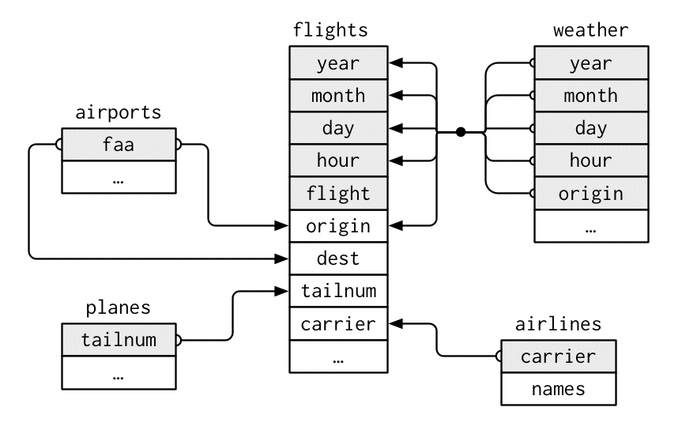

```{r setup, include=FALSE}
knitr::opts_chunk$set(echo = TRUE)
library(tidyverse)
library(nycflights13)
```

# Background and Objectives

## Background

Sistem manajemen basis data mengoganisasikan data dalam jumlah besar yang digunakan oleh perusahaan dalam transaksi-transaksi sehari-hari. Data harus diorganisasikan sehingga dapat digunakan untuk analisis dalam membantu pengambilan keputusan. Terkadang sebuah analisis tidak hanya melibatkan dari satu data tabel saja, melainkan dapat melibatkan beberapa data tabel yang harus digabungkan untuk menjawab permasalahan dari analisis yang sedang dilakukan. Beberapa data tabel yang mempunyai hubungan dapat disebut sebagai relasional data. Hubungan antara data tabel bisa terdiri dari dua tabel saja atau lebih.

Untuk bisa melakukan analisis pada relasional data maka diperlukan fungsi-fungsi yang dapat digunakan untuk menghubungkan data tabel yang ada, seperti fungsi mutating joins, filtering joins, dan set operations. Untuk menjalankan fungsi-fungsi tersebut dengan bahasa pemrograman R, Anda bisa menggunakan dplyr package untuk dapat melakukan analisis pada relasional data.

Tempat yang umum untuk menemukan relasional data yaitu ada di relational database management system yang merupakan istilah yang sering terdengar yang meliputi hampir semua sistem database.

## Objectives

Setelah membaca tulisan ini diharapkan bisa:

- Memahami konsep relasional data atau data yang berelasi

- Mengetahui fungsi-fungsi untuk bekerja dengan data yang berelasi pada program R

# Dataset

Data yang akan digunakan pada analisis ini adalah nycflights13 package yang terdiri dari beberapa data tabel yang saling berhubungan yang terdiri dari data flights, plane, airports, airline, wheater.

## Airlines Dataset

Data airlines ini merupakan data mengenai nama perusahaan penerbangan beserta kodenya. Data tersebut terdiri dari kolom:

- carrier : Two letter abbreviation

- name : Full name

```{r echo=FALSE}
airlines
```


## Airports Dataset

data airports merupakan data mengenai setiap airports yang diidentifikasi dengan kode airports. Data tersebut terdiri kolom:

- faa : FAA airport code

- name : Usual name of the aiport

- lat,lon : Location of airport

- alt : Altitude, in feet

- tz : Timezone offset from GMT

- dst : Daylight savings time zone. A = Standard US DST: starts on the second Sunday of March, ends on the first Sunday of November. U = unknown. N = no dst.

- tzone : IANA time zone, as determined by GeoNames webservice

```{r, echo=FALSE}
airports
```

## Planes Dataset

Data planes ini merupakan metadata untuk semua tail numbers yang teregister di FAA aircraft. Data tersebut dari kolom: 

- tailnum : Tail number

- year : Year manufactured

- type : Type of plane

- manufacturer,model : Manufacturer and model

- engines,seats : Number of engines and seats

- speed : Average cruising speed in mph

- engine : Type of engine

```{r, echo=FALSE}
planes
```

## Weather Dataset

Data weatherini merupakan data metorologi per jam. Data tersebut dari kolom:

- origin : Weather station. Named origin to faciliate merging with flights() data

- year,month,day,hour : Time of recording

- temp,dewp : Temperature and dewpoint in F

- humid : Relative humidity

- wind_dir,wind_speed,wind_gust : Wind direction (in degrees), speed and gust speed (in mph)

- precip : Precipitation, in inches

- pressure : Sea level pressure in millibars

- visib : Visibility in miles

- time_hour : Date and hour of the recording as a POSIXct date

```{r, echo=FALSE}
weather
```

## Flights Dataset

Data flights merupakan data mengenai waktu semua keberangkatan dari NYC pada tahun 2013. Data tersebut dari kolom:

On-time data for all flights that departed NYC (i.e. JFK, LGA or EWR) in 2013. Data frame with columns

- year,month,day : Date of departure

- dep_time,arr_time : Actual departure and arrival times (format HHMM or HMM), local tz.

- sched_dep_time,sched_arr_time : Scheduled departure and arrival times (format HHMM or HMM), local tz.

- dep_delay,arr_delay : Departure and arrival delays, in minutes. Negative times represent early departures/arrivals.

- hour,minute : Time of scheduled departure broken into hour and minutes.

- carrier : Two letter carrier abbreviation. See airlines() to get name

- tailnum : Plane tail number

- flight : Flight number

- origin,dest : Origin and destination. See airports() for additional metadata.

- air_time : Amount of time spent in the air, in minutes

- distance : Distance between airports, in miles

- time_hour : Scheduled date and hour of the flight as a POSIXct date. Along with origin, can be used to join flights data to weather data.

```{r, echo=FALSE}
flights
```

# Konsep Relasional Data

Konsep yang paling penting pada relasional data adalah key, yang mana merupakan sebuah variabel dalam sebuah tabel yang bisa dihubungkan dengan data tabel yang lain dan nilai pada filed atau variabel ini adalah nilai yang unik yang artinya bahwa nilai yang ada pada sebuah key nilainya tidak boleh ada yang sama. Terdapat 2 jenis key yaitu primary key dan foreign key.



Primary key adalah field atau variabel yang memiliki nilai unik pada setiap observasi pada tabel itu sendiri, sedangkan Foreign key adalah variabel yang memiliki nilai unik yang dapat mengidentifikasi setiap observasi pada tabel yang lain. Contoh Primary key adalah field tailnum pada tabel planes, sedangkan contoh foreign key adalah field tailnum pada tabel flights. Dari gambar di atas bisa dilihat bahwa setiap tabel dihubungkan dengan key yang ada pada setiap tabel. Tabel airlines mempunyai relasi atau hubungan dengan tabel flights yang dihubungkan dengan variabel carrier, selanjutnya tabel planes mempunyai relasi atau hubungan dengan tabel flights yang dihubungkan dengan variabel tailnum.

# Mutating Joins

Mutating joins adalah salah satu fungsi yang digunakan untuk menggabungkan dua tabel. Fungsi mutating join ini terbagi menjadi inner join, dan outer join.

## Inner Join

Fungsi inner join menggabungkan tabel dengan nilai key yang sesuai sehingga nilai key yang tidak sesuai akan dibuang.

```{r}
inner_join(flights, planes, by = "tailnum")
```

Dari fungsi inner join yang dilakukan terhadap tabel flights dan tabel planes dapat dilihat bahwa tabel baru tersebut adalah tabel gabungan dari tabel flight dengan tabel planes. Variabel terkahir pada tabel flight adalah time_hour dan dengan memasukan fungsi inner, maka variabel pada tabel baru hasil inner join tersebut bertambah dari variabel-variabel yang ada pada tabel planes. hal tersebut mirip seperti fungsi mutate yang menambahkan variabel pada suatu tabel.

Fungsi inner ini akan menghasilkan nilai yang sesuai saja dari tabel yang dihubungkan tersebut sehingga apabila key pada tabel tidak sesuai maka nilai pada observasi tersebut akan dibuang.

```{r, echo=FALSE}
flights$tailnum <- as.factor(flights$tailnum)
planes$tailnum <- as.factor(planes$tailnum)
```

```{r}
cek_inner <- data.frame(value = flights$tailnum %in% planes$tailnum)
cek_inner$value <- as.factor(cek_inner$value)
table(cek_inner$value)
```

Jumlah observasi hasil dari fungsi inner join antara tabel flights dengan planes adalah 284,170 observasi, yang mana jumlah tersebut adalah jumlah nilai yang sesuai antara variabel tailnum pada tabel flights dan variabel tailnum pada tabel planes. Sedangkan jumlah observasi sebanyak 52,606 adalah jumlah observasi atau nilai key yang tidak sesuai antara tabel flights dengan tabel planes.

## Outer Join

Fungsi outer join menggabungkan tabel dan tetap mempertahankan semua observasi pada salah satu tabel atau keduanya yang digabungkan apabila ada nilai key yang tidak sesuai atau tidak ada. fungsi ini dapat dibagi menjadi left join, right join, dan full join.

Untuk mempermudah contoh, Saya akan mensubset tabel flights dan tabel airlines menjadi seperti berikut ini:

```{r echo=FALSE}
flights_subset <- flights[1:8, c(1:3, 10)]
airlines_subset <- head(airlines)
```

```{r echo=FALSE}
flights_subset
airlines_subset
```


### Left Join

Fungsi left join menggabungkan dua tabel dengan mempertahan semua observasi pada tabel pertama apabila ada nilai key yang tidak sesuai atau tidak ada.

```{r}
left_join(flights_subset, airlines_subset, by = "carrier")
```

Karena ada key yang tidak sesuai antara tabel flight_subset dan tabel airlines_subset maka hasil dari fungsi tersebut akan ada nilai _NA_ pada variabel name, dan tabel yang nilai observasinya ditampilkan semua adalah tabel flights_subset yang mana tabel flights_subset adalah tabel pertama pada fungsi tersebut sehingga dapat dikatakan bahwa fungsi left join akan mempertahankan semua observasi pada tabel pertama pada fungsi tersebut apabila ada perbedaan nilai key.

```{r}
left_join(airlines_subset, flights_subset, by = "carrier")
```

Pada saat fungsi dibalik posisi tabel menjadi kebalikan dari tabel awal, variabel pertama dan ke-dua pada tabel tersebut adalah berasal tabel airlines, dan perbedaan selanjutnya yaitu urutan observasi pada tabel akan mengikuti urutan tabel pertama pada fungsi.


### Right Join

Fungsi right join menggabungkan dua tabel dengan mempertahan semua observasi pada tabel ke-dua apabila ada nilai key yang tidak sesuai atau tidak ada.

```{r}
right_join(flights_subset, airlines_subset, by = "carrier")
```

Karena ada key yang tidak sesuai antara tabel flight_subset dan tabel airlines_subset maka hasil dari fungsi tersebut akan ada nilai _NA_ pada variabel year, month, dan day , dan tabel yang nilai observasinya ditampilkan semua adalah tabel airlines_subset yang mana tabel airlines_subsety adalah tabel ke-dua pada fungsi tersebut sehingga dapat dikatakan bahwa fungsi right join akan mempertahankan semua observasi pada tabel ke-dua pada fungsi tersebut apabila ada perbedaan nilai key.

```{r warning=FALSE}
right_join(airlines_subset, flights_subset, by = "carrier")
```

Fungsi right join adalah kebalikan dari left join yaitu urutan observasi pada tabel akan mengikuti urutan tabel ke-dua pada fungsi.

### Full Join

Fungsi full join menggabungkan dua tabel dengan mempertahan semua observasi pada tabel pertama dan ke-dua apabila ada nilai key yang tidak sesuai atau tidak ada.

```{r}
full_join(flights_subset, airlines_subset, by = "carrier")
```

Walaupun ada key yang nilianya berbeda pada tabel flights_subset dan tabel airlines_subset, fungsi full join ini akan tetap menampilkan semua baris atau observasi untuk kedua tabel tersebut dan akan menghasilkan nilai _NA_.

Untuk mempermudah menggambarkan mengenai mutating joins yang telah disebutkan di atas, maka dapat dilihat gambar di bawah ini:


# Filtering Joins

Filtering joins akan menampilkan data atau tabel pertama pada fungsi yang sesuai dengan key pada data atau tabel ke-dua. Fungsi ini mirip dengan mutating joins namun pada fungsi ini tidak menambahkan variabel pada suatu tabel melainkan hanya menampilkan observasi pada tabel pertama. Karena hanya mempengaruhi observasi saja oleh karena itu fungsi ini disebut filtering join. Filtering joins ini terbagi menjadi semi join dan anti join:

## Semi Join

Semi join akan menampilkan atau mempertahankan tabel pertama pada fungsi yang memiliki key yang sesuai dengan tabel ke-dua pada fungsi tersebut.

```{r}
semi_join(flights_subset, airlines_subset, by = "carrier")
```

Pada data atau tabel flights_subset jumlah observasi adalah delapan observasi. Dengan melakukan fungsi semi join hasil dari fungsi tersebut menampilkan hanya lima observasi saja. Hal tersebut karena nilai key pada tabel pertama dan tabel ke-dua hanya ada lima sesuai, dan sekali lagi fungsi ini hanya mempengaruhi observasi saja dan tidak ada penambahan variabel baru.

## Anti Join

Anti join akan menampilkan atau mempertahankan tabel pertama pada fungsi yang tidak memiliki key yang sesuai dengan tabel ke-dua pada fungsi tersebut. Fungsi anti join ini adalah kebalikan dari fungsi semi join.

```{r}
anti_join(flights_subset, airlines_subset, by = "carrier")
```

Dari delapan observasi yang terdapat pada data atau tabel flights_subset hasil dari fungsi anti join menghasilkan tiga observasi yang mana observasi-observasi tersebut adalah observasi yang memiliki nilai key yang tidak sesuai antara tabel pertama dengan tabel ke-dua yaitu tabel flights_subset dengan airlines_subset.

# Set Operation

```{r echo=FALSE}
df1 <- data.frame(x = c(1,2,3,4,1), y = c("a","b","c","d","e"))
df2 <- data.frame(x = c(6,7,8,9,1), y = c("a","b","c","d","e"))
```

```{r}
df1
```

```{r}
df2
```

## Intersect

```{r}
intersect(df1, df2)
```

## Union

```{r}
union(df2, df1)
```

## Setdiff

```{r}
setdiff(df2, df1)
```